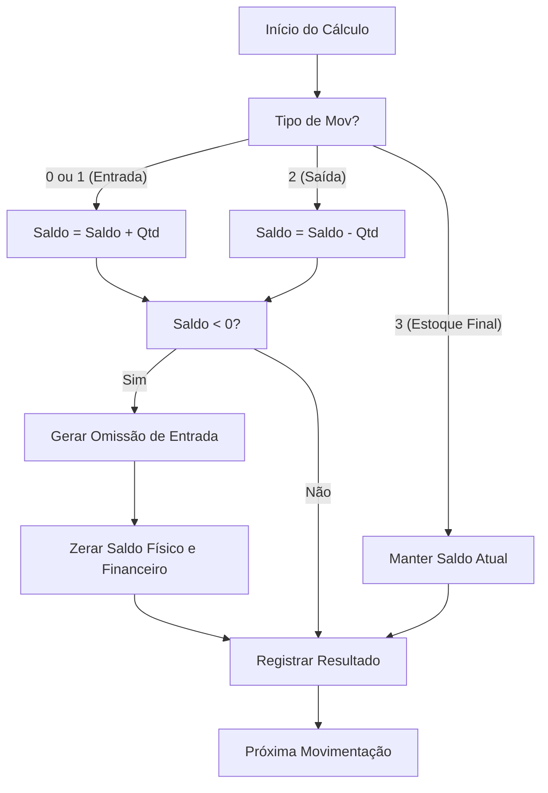
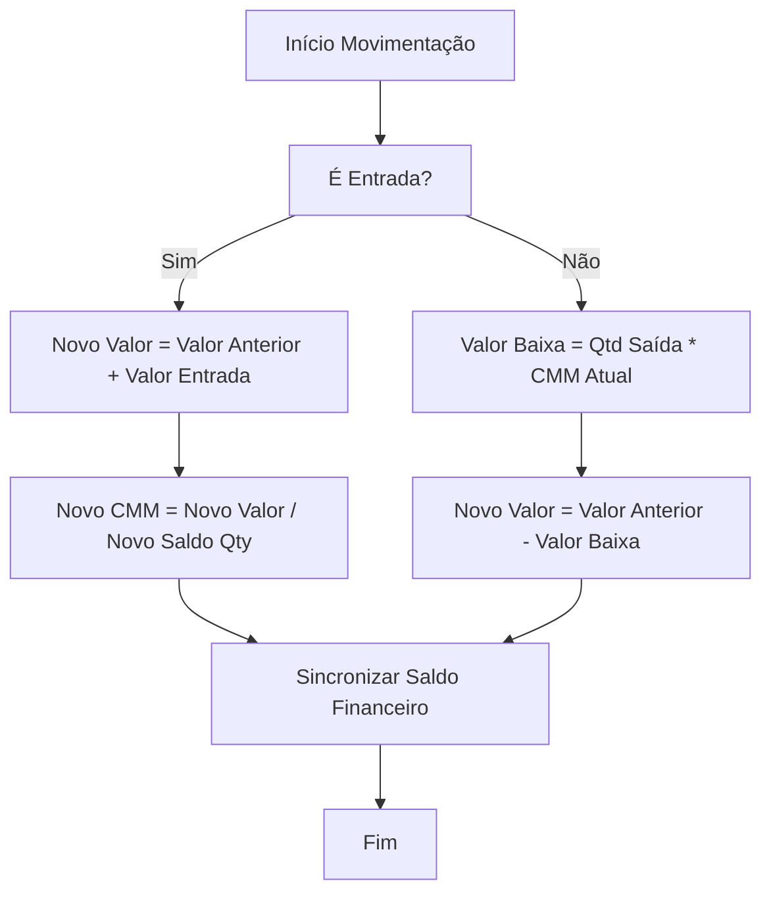

# Lógica de Cálculo de Estoque e Auditoria

Este documento descreve as metodologias utilizadas para o cálculo de saldo de estoque, detecção de entradas desacobertadas (omissões) e custo médio ponderado móvel.

## 1. Saldo de Estoque

O saldo de estoque é calculado de forma cronológica, processando cada movimentação individualmente por produto.

### Inclusões e Exclusões

* **Inclusões**:

  * **Estoque Inicial (Tipo 0)**: Saldo de abertura do período.
  * **Entradas (Tipo 1)**: Notas fiscais de entrada, transferências recebidas, etc.
* **Exclusões**:

  * **Saídas (Tipo 2)**: Notas fiscais de saída, vendas, consumos.
  * **Registros Marcados**: Movimentações com a flag `excluir_estoque` ou `mov_repetido` são ignoradas no cálculo de saldo.
* **Tratamento Especial**:

  * **Estoque Final Declarado (Tipo 3)**: Não altera o saldo acumulado; serve apenas como ponto de auditoria para comparação com o saldo calculado.

### Fluxograma de Saldo

---

## 2. Entradas Desacobertadas (Omissão de Entrada)

A omissão de entrada é detectada quando o sistema identifica que houve uma saída de mercadoria sem que houvesse saldo suficiente disponível. Isso indica que a mercadoria entrou fisicamente no estabelecimento sem documento fiscal (desacobertada).

### Regras de Negócio

1. **Detecção Instantânea**: Se durante o processamento cronológico o saldo físico ficar negativo, a diferença absoluta é registrada como `omissao_entrada`.
2. **Reset de Saldo**: Após uma omissão, o estoque é reiniciado do zero, pois a "entrada fictícia" gerada pela omissão apenas equilibra a saída que a originou.
3. **Auditoria de Estoque Final**: No fechamento anual, o sistema compara o estoque declarado pelo contribuinte (Bloco H / Tipo 3) com o saldo calculado. Se o calculado for menor que o declarado, indica que faltou registrar entradas para suportar o inventário final.

---

## 3. Custo Médio Ponderado Móvel (CMM)

O sistema utiliza o CMM para valorizar o estoque e as baixas (saídas).

### Metodologia

* **Na Entrada**: O custo médio é recalculado ponderando o saldo anterior e a nova entrada.

  * `CMM = (Valor_Estoque_Anterior + Valor_Nova_Entrada) / (Quantidade_Anterior + Quantidade_Entrada)`
* **Na Saída**: A saída é valorizada pelo CMM vigente.

  * `Valor_Baixa = Quantidade_Saída * CMM`

### Fluxograma de Custo Médio

> [!IMPORTANT]

> Se o saldo físico chegar a zero ou negativo em qualquer ponto, o saldo financeiro (em R$) é forçado a zero para evitar resíduos de arredondamento matemático.
>
