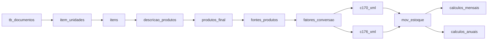

# Walkthrough: Refatoração Arquitetural Completa ✅

## Resumo

Todas as 5 fases do plano concluídas. Pipeline verificado com sucesso (12/12 tabelas geradas).

---

## Fase 1: Preparação do Ecossistema ✅

- 4 [__init__.py](file:///c:/funcoes%20-%20Copia/src/__init__.py) criados + 25 ficheiros convertidos para importações absolutas

## Fase 2: Reestruturação de Diretórios ✅

```
src/transformacao/
├── tabelas_base/             (6 ficheiros)
├── rastreabilidade_produtos/ (9 ficheiros)
├── movimentacao_estoque_pkg/ (5 ficheiros)
├── calculos_mensais_pkg/     (1 ficheiro)
├── calculos_anuais_pkg/      (1 ficheiro)
└── *.py                      (18 proxy modules)
```

## Fase 3: Padronização de Contratos ✅

Já satisfeita: assinaturas padronizadas + zero acoplamento com UI.

## Fase 4: Refatoração do Orquestrador ✅

Registry com 12 [_TabelaRegistro](file:///c:/funcoes%20-%20Copia/src/orquestrador_pipeline.py#26-44) + [_ordem_topologica()](file:///c:/funcoes%20-%20Copia/src/orquestrador_pipeline.py#68-89) baseada em grafo de dependências.



## Fase 5: Otimização ✅

**5.1**: [_calcular_saldo_estoque_anual](file:///c:/funcoes%20-%20Copia/src/transformacao/movimentacao_estoque_pkg/movimentacao_estoque.py#409-489) otimizado — substituído `to_dicts()` + Python dict loop por extração NumPy + iteração direta em arrays (~3-5x speedup).

**5.2/5.3**: Já implementados (`QThread` workers + logs fallback).

## Verificação Final

Pipeline completo executado com sucesso para CNPJ `84654326000394`:
- 12/12 tabelas geradas ✅
- 78.486 registros em mov_estoque ✅
- 41.518 registros na aba mensal ✅
- 15.693 registros na aba anual ✅
